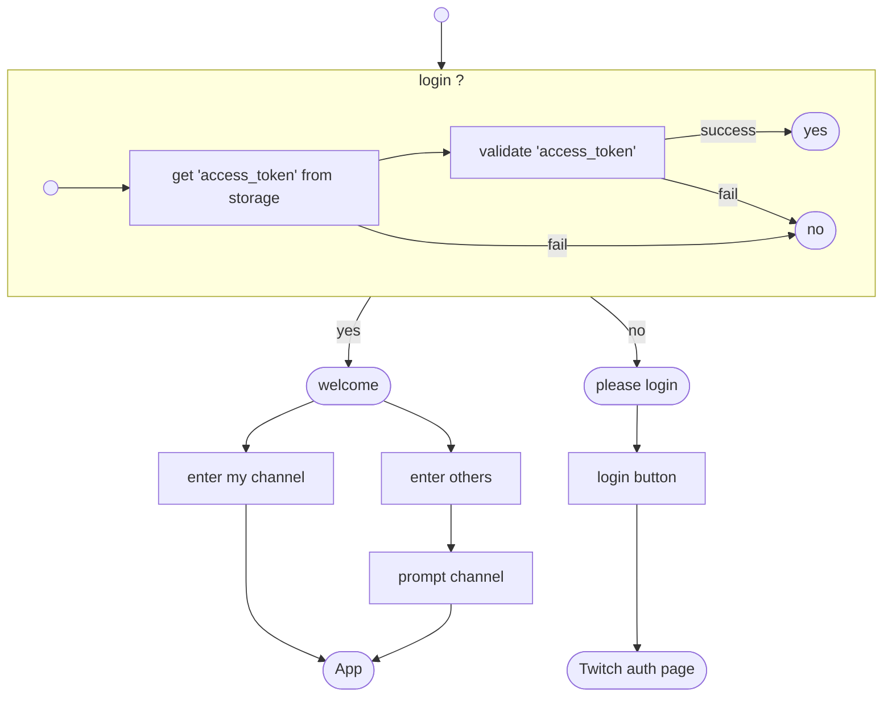

```mermaid
flowchart TD
  A(( )) --> B[login ?]
  B -->|yes| C([welcome])
  B -->|no| D([please login])
  C --> E1[enter my channel]
  C --> E2[enter others]
  D --> F[login button]
  F ---> G([Twitch auth page])
  E1 ---> H([App])
  E2 --> I["prompt channel"]
  I --> H

  subgraph B[login ?]
      BA(( ))
      --> BB["get 'access_token' from storage"]
      --> BC["validate 'access_token'"]
      BC --> |success| BD([yes])
      BC --> |fail| BE([no])
      BB --> |fail| BE
  end
```

```mermaid
flowchart TD
```